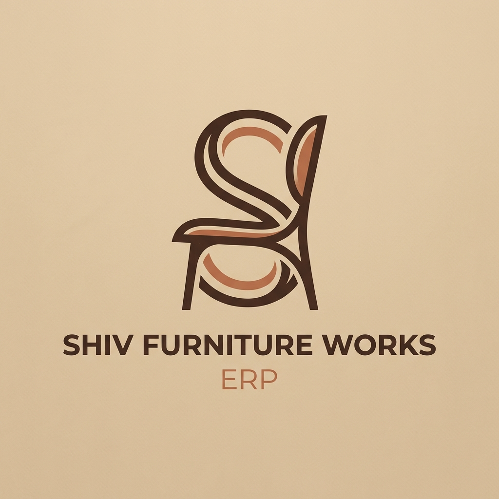
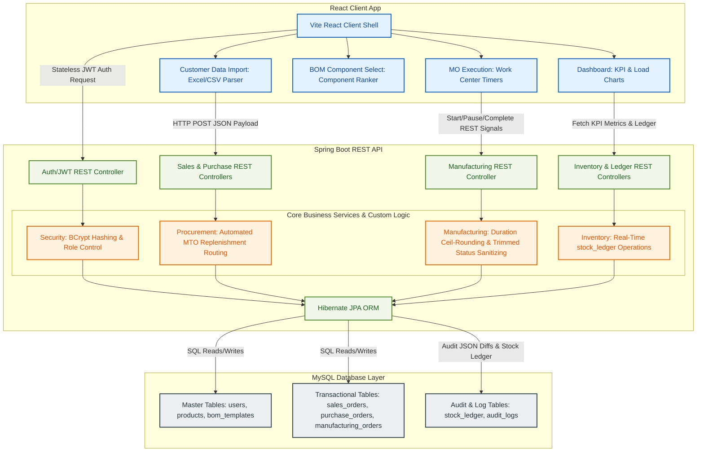
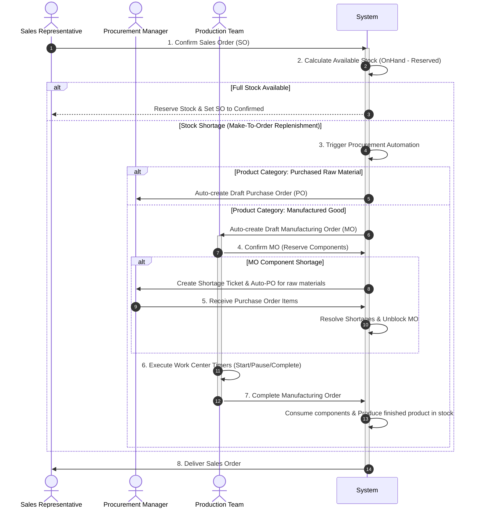

<p align="center">
  
</p>

# Shiv Furniture Works — Mini ERP System
> A modern, premium, integrated enterprise resource planning system tailored for furniture manufacturing operations.

---

## 🛠️ Technology Stack
*   **Backend API Service**: Spring Boot 3.2.5 (Java 21), Spring Data JPA, Spring Security (JWT, BCrypt)
*   **Database Engine**: MySQL 8.x (`shiv_erp` database schema)
*   **Frontend SPA**: React 18, TanStack Router, Zustand (State Store), Vite, TailwindCSS (Styles), Lucide Icons
*   **Data Serialization**: Excel/CSV (`.xlsx`/`.csv`) parsing via SheetJS, PDF Report generation via jsPDF

---

## 📐 System Architecture

### 1. High-Level Data Flow


### 2. End-to-End Demand-to-Delivery Process Workflow
This sequence diagram tracks the automation flow when a customer order requires products that are out of stock.



---

## 📋 Comprehensive Module Overview

### 🔐 Authentication & Session Security
*   **One-Way Hashes**: User passwords are encrypted using **BCrypt** with a default cost factor of `10`, generating 60-character salted database strings.
*   **Access Control**: Authentication is stateless, secured via **JWTs**. Client applications send the token in the `Authorization: Bearer` header on every request. Spring Security intercepts these requests and filters routes at the server-level using `@PreAuthorize`.
*   **Role Hierarchy**: Configured roles include `Admin` (full system configuration), `Sales` (demand management), `Purchase` (supplier management), `Manufacturing` (operations), `Inventory` (stock ledger), and `Owner` (read-only audit observer).

---

### 📦 Product & Inventory Master Data
*   **Unified SKU Registry**: Tracks individual attributes, sale vs cost pricing, replenishment threshold limits, and strategy definitions (`MTS` - Make to Stock, `MTO` - Make to Order).
*   **Transactional Stock Ledger**: Every inventory change writes an entry to the append-only `stock_ledger` table. Tracks ledger events including sales reservations, supplier receipts, and factory consumption.
*   **Dynamic Computations**: Product inventories show three values:
    $$\text{OnHand (Total physical units)} \quad \rightarrow \quad \text{Reserved (Committed to orders)} \quad \rightarrow \quad \text{Free-to-Use (Available for sale)}$$

---

### 🛒 Sales & Spreadsheet Import
*   **Lifecycle Management**: Tracks order status transitions: `Draft → Confirmed → Partially Delivered → Fully Delivered` (or `Cancelled`).
*   **Bulk Loading**: Users can upload `.xlsx`, `.xls`, or `.csv` spreadsheets directly to the browser. Client-side script parses headers and uses regex matching to map data to lines automatically.

---

### 🚚 Procurement & Supplier Management
*   **Direct Vendor Linking**: Products link to preferred vendor profiles.
*   **Automated Purchasing**: Shortage alerts bundle items into draft purchase orders.
*   **Goods Receipt Processing**: Receiving materials adds count to `onHandQty`, automatically updates waiting sales orders, resolves active shortage tickets, and unblocks pending factory builds.

---

### 🏭 Manufacturing & Work Centers
*   **Recipe Definitions (BoMs)**: BoMs model multi-level structures containing specific material ingredients and operation sequences.
*   **Work Center Dispatching**: Splitting builds into steps assigned to specific stations (e.g., cutting bay, packing center).
*   **Precision Duration Timers**: Work Order cards run live timers inside the browser context, updating backend database timestamps (`started_at`, `paused_at`, `completed_at`) via REST calls. Calculates durations using a ceil-rounding strategy so that short runs register accurately.

---

### 📊 KPI Analytics & Audit logs
*   **Dashboard Panels**: Horizontal graphs displaying work center load bottlenecks, donut charts of stock ratios, daily sales trends, and real-time operational KPI counts.
*   **Traceability**: Every system mutation is recorded in `audit_logs` showing field-level old/new JSON diff values. Supports filters and downloading custom-styled PDF reports.

---

## 📂 Project Directory Structure

```
shiv-furniture-erp-odoo/
├── backend/                  # Spring Boot Backend API
│   ├── src/main/java/com/shiv/erp/
│   │   ├── config/           # CORS & Security configurations
│   │   ├── controller/       # REST API Endpoint Controllers
│   │   ├── model/            # 16 Database Table Entities
│   │   ├── repository/       # JPA Database Access Repositories
│   │   ├── security/         # JWT Security Filters
│   │   └── service/          # Core Business Services (Sales, Procurement, etc.)
│   └── pom.xml               # Maven configuration
│
├── shiv-furniture-works/     # React Vite Frontend SPA
│   ├── src/
│   │   ├── routes/           # UI Route Layouts
│   │   ├── components/erp/   # SpreadsheetImport, Layout, Stepper widgets
│   │   └── lib/erp/          # Zustand State store, types, seed definitions
│   └── package.json          # Node dependencies
│
└── logo.png                  # Brand logo
```

---

## ⚡ How to Run

### 1. Bootstrapping Database
Create a MySQL database schema:
```sql
CREATE DATABASE IF NOT EXISTS shiv_erp;
```

### 2. Launch Backend API
```bash
cd backend
mvn spring-boot:run -DskipTests
```
*API runs on `http://localhost:4000`*

### 3. Launch Frontend Client
```bash
cd shiv-furniture-works
npm install
npm run dev -- --host
```
*Vite web server runs on `http://localhost:8080`*

### 4. Admin Credentials
*   **Email**: `admin@shiv.co`
*   **Password**: `admin`
